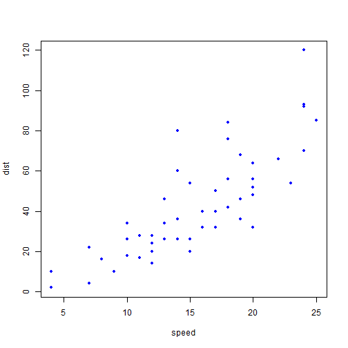

  
## Read-And-Delete
  
> 1. Introduction
> 2. how to write an equation
> 3. Plot in R
> 4. Conclusion

--- 
  
## Writting an Equations in R
  
# $ CMR = \hat{ \alpha } +  \ \hat{ \beta}PGNP +  \ \hat{ \gamma }  FLR + \ \hat{ \epsilon } $
where : CMR = Child Mortality Rate
PGNP = per capita GNP
FMR = Female Literacy Rate

---
  

```r
plot(cars, pch = 20, col = "blue")
```



---
## Code with output
  

```r
summary(cars)
```

```
##      speed           dist       
##  Min.   : 4.0   Min.   :  2.00  
##  1st Qu.:12.0   1st Qu.: 26.00  
##  Median :15.0   Median : 36.00  
##  Mean   :15.4   Mean   : 42.98  
##  3rd Qu.:19.0   3rd Qu.: 56.00  
##  Max.   :25.0   Max.   :120.00
```

---
## code without the output

```r
summary(cars)
```

---
  
  
## How to read data in slidify

```r
setwd("D:/R April/R Data Visualisation/Section 05/data")
data = read.csv("final.csv" , sep = ",", header = TRUE)
head(data)
```

```
##       Country Years     life  fert      pop
## 1 Afghanistan  2000 54.84856 7.733 20595360
## 2 Afghanistan  2001 55.25622 7.623 21347782
## 3 Afghanistan  2002 55.67188 7.484 22202806
## 4 Afghanistan  2003 56.10756 7.321 23116142
## 5 Afghanistan  2004 56.56973 7.136 24018682
## 6 Afghanistan  2005 57.05844 6.930 24860855
```

---
## Including a table in your slide

```r
knitr::kable(data)
```


|Country       | Years|     life|   fert|        pop|
|:-------------|-----:|--------:|------:|----------:|
|Afghanistan   |  2000| 54.84856| 7.7330|   20595360|
|Afghanistan   |  2001| 55.25622| 7.6230|   21347782|
|Afghanistan   |  2002| 55.67188| 7.4840|   22202806|
|Afghanistan   |  2003| 56.10756| 7.3210|   23116142|
|Afghanistan   |  2004| 56.56973| 7.1360|   24018682|
|Afghanistan   |  2005| 57.05844| 6.9300|   24860855|
|Afghanistan   |  2006| 57.57066| 6.7020|   25631282|
|Afghanistan   |  2007| 58.09137| 6.4560|   26349243|
|Afghanistan   |  2008| 58.60710| 6.1960|   27032197|
|Afghanistan   |  2009| 59.11234| 5.9280|   27708187|
|Afghanistan   |  2010| 59.60010| 5.6590|   28397812|
|Afghanistan   |  2011| 60.06537| 5.3950|   29105480|
|Afghanistan   |  2012| 60.50912| 5.1410|   29824536|
|Australia     |  2000| 79.23415| 1.7560|   19153000|
|Australia     |  2001| 79.63415| 1.7390|   19413000|
|Australia     |  2002| 79.93659| 1.7560|   19651400|
|Australia     |  2003| 80.23902| 1.7480|   19895400|
|Australia     |  2004| 80.49024| 1.7680|   20127400|
|Australia     |  2005| 80.84146| 1.8070|   20394800|
|Australia     |  2006| 81.04146| 1.9080|   20697900|
|Australia     |  2007| 81.29268| 1.9590|   20827600|
|Australia     |  2008| 81.39512| 1.9630|   21249200|
|Australia     |  2009| 81.54390| 1.8880|   21691700|
|Australia     |  2010| 81.69512| 1.9270|   22031800|
|Australia     |  2011| 81.89512| 1.9270|   22340000|
|Australia     |  2012| 82.09512| 1.9270|   22723900|
|Austria       |  2000| 78.02683| 1.3600|    8011566|
|Austria       |  2001| 78.52683| 1.3300|    8042293|
|Austria       |  2002| 78.67805| 1.3900|    8081957|
|Austria       |  2003| 78.63171| 1.3800|    8121423|
|Austria       |  2004| 79.18049| 1.4200|    8171966|
|Austria       |  2005| 79.33171| 1.4100|    8227829|
|Austria       |  2006| 79.83171| 1.4100|    8268641|
|Austria       |  2007| 79.98293| 1.3800|    8300788|
|Austria       |  2008| 80.23415| 1.4100|    8336926|
|Austria       |  2009| 80.08293| 1.3900|    8365275|
|Austria       |  2010| 80.38293| 1.4400|    8389771|
|Austria       |  2011| 80.98293| 1.4300|    8406187|
|Austria       |  2012| 80.93659| 1.4400|    8429991|
|Bangladesh    |  2000| 65.31973| 3.1200|  132383265|
|Bangladesh    |  2001| 65.79034| 3.0110|  134729503|
|Bangladesh    |  2002| 66.23990| 2.9050|  137006279|
|Bangladesh    |  2003| 66.67093| 2.8020|  139185986|
|Bangladesh    |  2004| 67.08598| 2.7020|  141235035|
|Bangladesh    |  2005| 67.48956| 2.6070|  143135180|
|Bangladesh    |  2006| 67.88727| 2.5200|  144868702|
|Bangladesh    |  2007| 68.28315| 2.4430|  146457067|
|Bangladesh    |  2008| 68.68071| 2.3770|  147969967|
|Bangladesh    |  2009| 69.08193| 2.3220|  149503100|
|Bangladesh    |  2010| 69.48580| 2.2770|  151125475|
|Bangladesh    |  2011| 69.89180| 2.2400|  152862431|
|Bangladesh    |  2012| 70.29485| 2.2080|  154695368|
|Canada        |  2000| 79.23659| 1.4900|   30769700|
|Canada        |  2001| 79.48780| 1.5050|   31081900|
|Canada        |  2002| 79.59024| 1.5200|   31362000|
|Canada        |  2003| 79.83902| 1.5300|   31676000|
|Canada        |  2004| 80.14146| 1.5300|   31995000|
|Canada        |  2005| 80.29268| 1.5400|   32312000|
|Canada        |  2006| 80.64390| 1.5862|   32570505|
|Canada        |  2007| 80.36988| 1.6589|   32887928|
|Canada        |  2008| 80.54322| 1.6808|   33245773|
|Canada        |  2009| 80.71710| 1.6680|   33628571|
|Canada        |  2010| 80.89349| 1.6269|   34005274|
|Canada        |  2011| 81.06832| 1.6100|   34342780|
|Canada        |  2012| 81.23805| 1.6100|   34754312|
|Spain         |  2000| 78.96585| 1.2300|   40263216|
|Spain         |  2001| 79.36829| 1.2400|   40756001|
|Spain         |  2002| 79.56829| 1.2500|   41431558|
|Spain         |  2003| 79.61951| 1.3000|   42187645|
|Spain         |  2004| 79.87073| 1.3100|   42921895|
|Spain         |  2005| 80.17073| 1.3300|   43653155|
|Spain         |  2006| 80.82195| 1.3600|   44397319|
|Spain         |  2007| 80.87317| 1.3800|   45226803|
|Spain         |  2008| 81.17561| 1.4500|   45954106|
|Spain         |  2009| 81.47561| 1.3800|   46362946|
|Spain         |  2010| 81.62683| 1.3700|   46576897|
|Spain         |  2011| 82.47561| 1.3400|   46742697|
|Spain         |  2012| 82.37805| 1.3200|   46761264|
|Ethiopia      |  2000| 52.24115| 6.5290|   66024199|
|Ethiopia      |  2001| 52.94695| 6.3800|   67956866|
|Ethiopia      |  2002| 53.73488| 6.2180|   69948344|
|Ethiopia      |  2003| 54.60885| 6.0460|   71989666|
|Ethiopia      |  2004| 55.56134| 5.8700|   74066147|
|Ethiopia      |  2005| 56.57180| 5.6930|   76167240|
|Ethiopia      |  2006| 57.61522| 5.5200|   78290649|
|Ethiopia      |  2007| 58.65366| 5.3530|   80440708|
|Ethiopia      |  2008| 59.65627| 5.1930|   82621190|
|Ethiopia      |  2009| 60.60015| 5.0430|   84838032|
|Ethiopia      |  2010| 61.46795| 4.9020|   87095281|
|Ethiopia      |  2011| 62.25285| 4.7690|   89393063|
|Ethiopia      |  2012| 62.96595| 4.6420|   91728849|
|Ghana         |  2000| 56.98759| 4.6690|   18825034|
|Ghana         |  2001| 57.14761| 4.6170|   19293392|
|Ghana         |  2002| 57.42193| 4.5660|   19786307|
|Ghana         |  2003| 57.78666| 4.5120|   20301686|
|Ghana         |  2004| 58.22485| 4.4550|   20835514|
|Ghana         |  2005| 58.70454| 4.3920|   21384034|
|Ghana         |  2006| 59.18671| 4.3260|   21947779|
|Ghana         |  2007| 59.63785| 4.2570|   22525659|
|Ghana         |  2008| 60.02995| 4.1880|   23110139|
|Ghana         |  2009| 60.35102| 4.1190|   23691533|
|Ghana         |  2010| 60.59956| 4.0520|   24262901|
|Ghana         |  2011| 60.78859| 3.9850|   24820706|
|Ghana         |  2012| 60.94712| 3.9200|   25366462|
|India         |  2000| 62.16185| 3.1450| 1042261758|
|India         |  2001| 62.55663| 3.0830| 1059500888|
|India         |  2002| 62.94934| 3.0180| 1076705723|
|India         |  2003| 63.34005| 2.9520| 1093786762|
|India         |  2004| 63.72427| 2.8840| 1110626108|
|India         |  2005| 64.09759| 2.8170| 1127143548|
|India         |  2006| 64.45510| 2.7530| 1143289350|
|India         |  2007| 64.79385| 2.6940| 1159095250|
|India         |  2008| 65.11339| 2.6430| 1174662334|
|India         |  2009| 65.41320| 2.6000| 1190138069|
|India         |  2010| 65.69424| 2.5630| 1205624648|
|India         |  2011| 65.95849| 2.5320| 1221156319|
|India         |  2012| 66.21085| 2.5050| 1236686732|
|United States |  2000| 76.63659| 2.0560|  282162411|
|United States |  2001| 76.73659| 2.0305|  284968955|
|United States |  2002| 76.83659| 2.0205|  287625193|
|United States |  2003| 76.98780| 2.0475|  290107933|
|United States |  2004| 77.33902| 2.0515|  292805298|
|United States |  2005| 77.33902| 2.0570|  295516599|
|United States |  2006| 77.58780| 2.1080|  298379912|
|United States |  2007| 77.83902| 2.1200|  301231207|
|United States |  2008| 77.93902| 2.0720|  304093966|
|United States |  2009| 78.09024| 2.0020|  306771529|
|United States |  2010| 78.54146| 1.9310|  309326295|
|United States |  2011| 78.64146| 1.8945|  311582564|
|United States |  2012| 78.74146| 1.8805|  313873685|

---
## embedding an image in presentation
  
image: 

---

```r
library(googleVis)
```

```
## Warning: package 'googleVis' was built under R version 3.3.3
```

```r
op <- options(gvis.plot.tag='chart')
```

---


```r
## Add the mean
CityPopularity$Mean=mean(CityPopularity$Popularity)
CC <- gvisComboChart(CityPopularity, xvar='City',
                     yvar=c('Mean', 'Popularity'),
                     options=list(seriesType='bars',
                                  width=450, height=300,
                                  title='City Popularity',
                                  series='{0: {type:\"line\"}}'))
plot(CC)
```

<!-- ComboChart generated in R 3.3.1 by googleVis 0.6.2 package -->
<!-- Thu May 04 16:52:22 2017 -->


<!-- jsHeader -->
<script type="text/javascript">
 
// jsData 
function gvisDataComboChartIDc4073fc266f () {
var data = new google.visualization.DataTable();
var datajson =
[
 [
"New York",
450,
200
],
[
"Boston",
450,
300
],
[
"Miami",
450,
400
],
[
"Chicago",
450,
500
],
[
"Los Angeles",
450,
600
],
[
"Houston",
450,
700
] 
];
data.addColumn('string','City');
data.addColumn('number','Mean');
data.addColumn('number','Popularity');
data.addRows(datajson);
return(data);
}
 
// jsDrawChart
function drawChartComboChartIDc4073fc266f() {
var data = gvisDataComboChartIDc4073fc266f();
var options = {};
options["allowHtml"] = true;
options["seriesType"] = "bars";
options["width"] = 450;
options["height"] = 300;
options["title"] = "City Popularity";
options["series"] = {0: {type:"line"}};

    var chart = new google.visualization.ComboChart(
    document.getElementById('ComboChartIDc4073fc266f')
    );
    chart.draw(data,options);
    

}
  
 
// jsDisplayChart
(function() {
var pkgs = window.__gvisPackages = window.__gvisPackages || [];
var callbacks = window.__gvisCallbacks = window.__gvisCallbacks || [];
var chartid = "corechart";
  
// Manually see if chartid is in pkgs (not all browsers support Array.indexOf)
var i, newPackage = true;
for (i = 0; newPackage && i < pkgs.length; i++) {
if (pkgs[i] === chartid)
newPackage = false;
}
if (newPackage)
  pkgs.push(chartid);
  
// Add the drawChart function to the global list of callbacks
callbacks.push(drawChartComboChartIDc4073fc266f);
})();
function displayChartComboChartIDc4073fc266f() {
  var pkgs = window.__gvisPackages = window.__gvisPackages || [];
  var callbacks = window.__gvisCallbacks = window.__gvisCallbacks || [];
  window.clearTimeout(window.__gvisLoad);
  // The timeout is set to 100 because otherwise the container div we are
  // targeting might not be part of the document yet
  window.__gvisLoad = setTimeout(function() {
  var pkgCount = pkgs.length;
  google.load("visualization", "1", { packages:pkgs, callback: function() {
  if (pkgCount != pkgs.length) {
  // Race condition where another setTimeout call snuck in after us; if
  // that call added a package, we must not shift its callback
  return;
}
while (callbacks.length > 0)
callbacks.shift()();
} });
}, 100);
}
 
// jsFooter
</script>
 
<!-- jsChart -->  
<script type="text/javascript" src="https://www.google.com/jsapi?callback=displayChartComboChartIDc4073fc266f"></script>
 
<!-- divChart -->
  
<div id="ComboChartIDc4073fc266f" 
  style="width: 450; height: 300;">
</div>

---
  
  
